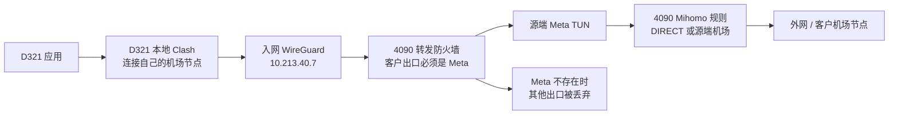

# 4090 代理退出与恢复教程

**在 4090 的 Ubuntu 终端逐条执行。不要在你的 Windows 本机执行。**

| 操作 | 命令 |
| --- | --- |
| 暂停自动修复检查 | `sudo systemctl stop gateway-health.timer` |
| 停止正在执行的修复检查 | `sudo systemctl stop gateway-health.service` |
| 退出 Mihomo 和运行中的 TUN | `sudo systemctl stop mihomo.service` |
| 恢复原配置中的代理及 TUN | `sudo systemctl start mihomo.service` |
| 恢复自动修复检查 | `sudo systemctl start gateway-health.timer` |
| 核心运行状态 | `systemctl is-active mihomo.service` |
| 检查实际 TUN 网卡 | `ip address show dev Meta` |

**停止前先安排下面的自动恢复。当前客户出口依赖源端 Meta；停止核心期间，入网客户端的公网连接也会中断。** 单独停止 Mihomo 会被自动修复重新启动；本次实际发生过约 10 秒后重启。

## 当前要恢复到的状态

2026-09-17 实测主机 `a-MS-7E06`，校园 IP `10.20.32.13`：

| 项目 | 测试前及恢复后 |
| --- | --- |
| 核心 | `mihomo.service`，active，开机自启 enabled |
| 配置 | `/etc/mihomo/config.yaml` |
| 模式 | `rule` |
| TUN | 配置 `tun.enable: true`，运行网卡 `Meta` |
| 本机代理端口 | `127.0.0.1:7897`，不允许 LAN 直接连接该端口 |
| 源端规则选中的机场节点 | 本次日志为“新加坡 01 \| 专线” |
| GNOME 当前用户系统代理 | `none`，恢复时不需要改成 manual |
| 自动修复 | `gateway-health.timer`，active / enabled |
| 客户中继计量 | `server-network-assist-relay.timer`，active / enabled |

配置文件 SHA-256：`f378400069f1a76b289a69384ea96fc9b692187f09522a59dd8bc5ed54faa278`。这是本次快照，日后更新订阅或配置后不能继续当作期望值。

关闭 GNOME 系统代理不等于关闭 Mihomo/TUN。源端 GNOME 目前本来就没有启用系统代理，客户仍然使用源端的 TUN 转发。

## 一次可回退的停止操作

先确认机器及现状：

```bash
hostname
```

应为 `a-MS-7E06`。下面流程按两个服务当前 active / enabled 编写；如果现状不同，先记录实际值，不要直接套用恢复步骤。

```bash
systemctl show mihomo.service gateway-health.timer -p Id -p ActiveState -p UnitFileState
```

```bash
sudo sha256sum /etc/mihomo/config.yaml
```

可保留一份本次配置备份，目录只允许 root 访问：

```bash
SNA_BACKUP_DIR="/var/backups/mihomo-manual-$(date +%Y%m%d-%H%M%S)"
```

```bash
sudo install -d -m 0700 "$SNA_BACKUP_DIR"
```

```bash
sudo cp -a /etc/mihomo/config.yaml "$SNA_BACKUP_DIR/config.yaml"
```

安排三分钟后自动启动核心及守护计时器。使用唯一任务名，在同一终端保留变量：

```bash
SNA_RESCUE_UNIT="sna4090-proxy-rescue-$(date +%Y%m%d-%H%M%S)"
```

```bash
sudo systemd-run --unit="$SNA_RESCUE_UNIT" --on-active=3m /usr/bin/systemctl start mihomo.service gateway-health.timer
```

```bash
systemctl is-active "$SNA_RESCUE_UNIT.timer"
```

只有返回 `active` 才继续。依次停止守护计时器、正在执行的检查和核心：

```bash
sudo systemctl stop gateway-health.timer
```

```bash
sudo systemctl stop gateway-health.service
```

```bash
sudo systemctl stop mihomo.service
```

核验：

```bash
systemctl show mihomo.service gateway-health.timer -p Id -p ActiveState -p UnitFileState
```

```bash
ip address show dev Meta
```

期望核心 inactive、计时器 inactive、Meta 不存在；两个开机自启设置仍然 enabled。配置中 `tun.enable: true` 保留，它描述下次启动的配置，不代表停机期间 TUN 仍在运行。

本流程不停止 `sna-commercial`、管理 WireGuard、客户计量中继，也不删除校园路由和防火墙。

## 恢复本次原状态

没有编辑 YAML 时，不需要覆盖配置备份，直接启动原服务：

```bash
sudo systemctl start mihomo.service
```

```bash
sudo systemctl start gateway-health.timer
```

```bash
systemctl show mihomo.service gateway-health.timer server-network-assist-relay.timer -p Id -p ActiveState -p UnitFileState
```

```bash
ip address show dev Meta
```

Meta 创建可能稍晚于 systemd 报 active；等待几秒再查。还要核验配置哈希与停机前相同：

```bash
sudo sha256sum /etc/mihomo/config.yaml
```

从已经入网的客户机实际访问外网、调用模型，并检查校园 SSH 可达。只有实际连接恢复后，才取消三分钟救援计时器：

```bash
sudo systemctl stop "$SNA_RESCUE_UNIT.timer"
```

如果关闭了终端、丢失变量，允许救援自然触发即可；对已经启动的服务再次 start 不会重启它。

如果期间确实编辑了 YAML，先核对所选备份属于本次停止，再恢复并校验，成功后 restart 核心：

```bash
sudo cp -a "$SNA_BACKUP_DIR/config.yaml" /etc/mihomo/config.yaml
```

```bash
sudo /usr/local/bin/mihomo -t -d /var/lib/mihomo -f /etc/mihomo/config.yaml
```

```bash
sudo systemctl restart mihomo.service
```

本次实际测试没有修改 YAML，不曾执行覆盖恢复或 disable 自启。

## 本次真实测试结果

客户端为 **D321 Windows**，不是操作员本机。启动 D321 自己的 Mihomo 和系统代理，规则模式、客户端 TUN 关闭，底层绑定入网隧道。源端停机时，不更改源端防火墙来绕过限制。

| 阶段 | 4090 状态 | D321 本地代理探测 | Codex |
| --- | --- | --- | --- |
| 停机前 | 核心及 Meta 运行 | Google 204、ChatGPT 200、百度 200，TLS 正常 | 本地代理路径出现 TLS close_notify 异常，20 秒无回复 |
| 第一轮直接停止 | 约 10 秒后被 gateway-health 自动启动 | 停机初期三个请求超时 | 之后有完成事件，源端已被重新启动；不能作为关闭源端代理仍成功的证据 |
| 第二轮受控停止，15:10:13–15:11:28 | 守护检查暂停，核心停止、Meta 消失 | 三个请求均超时；本地代理进程、7897 监听仍存在 | 20 秒无回复，主动终止本次测试进程 |
| 恢复后，本地代理仍开启 | 核心及 Meta 恢复 | 百度 200；Google/ChatGPT 此次仍超时 | 本次无回复，不宣称本地机场代理恢复验收通过 |
| 最终恢复 D321 测试前状态 | 4090 rule / TUN 开；D321 本地核心和系统代理关闭，入网保持 | D321 无 HTTP 代理访问 ChatGPT 200，TLS 正常 | 实际模型回复 `SOURCE_NETWORK_OK`，退出码 0 |

第二轮 source journal 确认整个客户端测试期间没有重启核心；40 次状态采样均为核心停止、Meta 不存在、守护计时器停止，主配置及防火墙规则保持一致。D321 到 4090/5080/D408 校园 SSH 在测试及恢复检查中可达；D437 仍超时，延续既有待查项。

**结论：当前部署不能在源端 Mihomo/TUN 完全关闭时，仅开启客户端机场代理继续经 4090 出口访问 GPT。**



客户端机场协议也需要先连到自己的机场服务器；WireGuard只提供隧道，当前防火墙只放行出口 Meta，并仅在 Meta 做客户 NAT。关闭源端 TUN 后，客户端机场节点的底层连接也无法通过这个出口。需要另外实现可配置的“源端物理宽带转发/NAT、客户端自主代理”模式，才能将源端代理与入网带宽分开；本次没有修改防火墙来实现该模式。

## 不要把网页响应和代理能力混为一谈

恢复后，4090 系统解析 `chatgpt.com` 为 `108.160.166.62`；普通无 HTTP 代理 curl 仍出现 TLS EOF。`/etc/hosts` 未找到该域名条目。改为单次请求显式走本机 7897、或使用当时有效的 TUN fake-IP 映射，可收到 **403，证书校验正常**。这些证据提示系统解析路径与代理解析路径存在差异，尚未确认具体污染来源，未修改全局 DNS。

403 说明收到了 HTTP 响应，不代表网页、账号或模型请求全部可用。D321 最终模型真实调用成功则单独记录。`198.18.0.7` 是当时的动态 fake-IP，不是 ChatGPT 公网固定地址，不能写入 hosts 或作为长期教程命令。

详细实施证据：[OPS-NET-022](借网管理面板/handoffs/2026-09-17-4090停用恢复与客户端代理出口测试.md)。其他模式、系统代理及 TUN 编辑命令：[4090代理命令大全](4090代理命令大全.md)。
