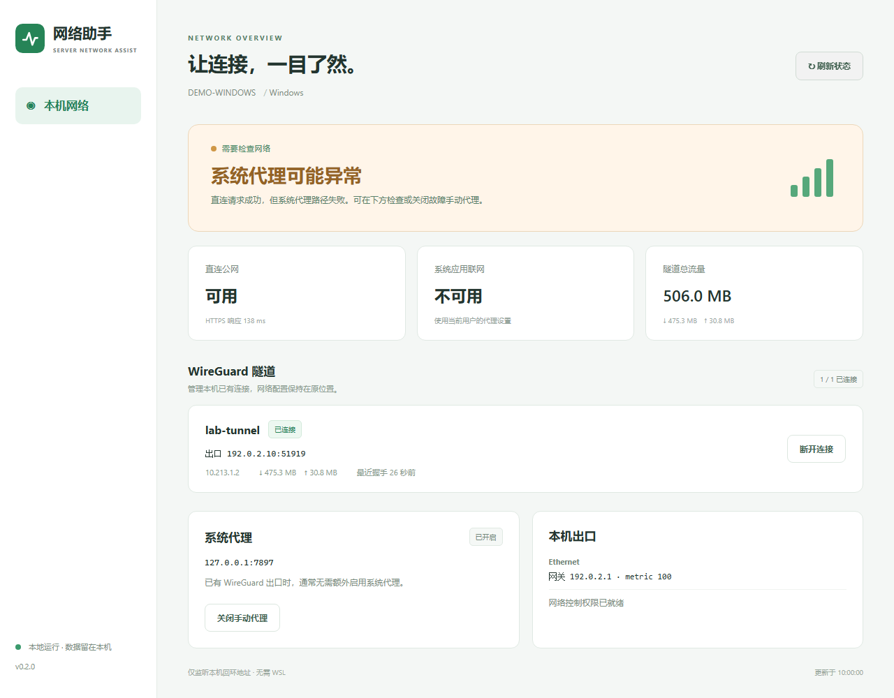
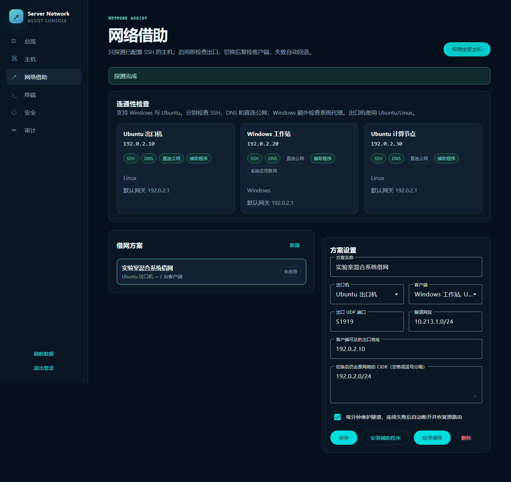
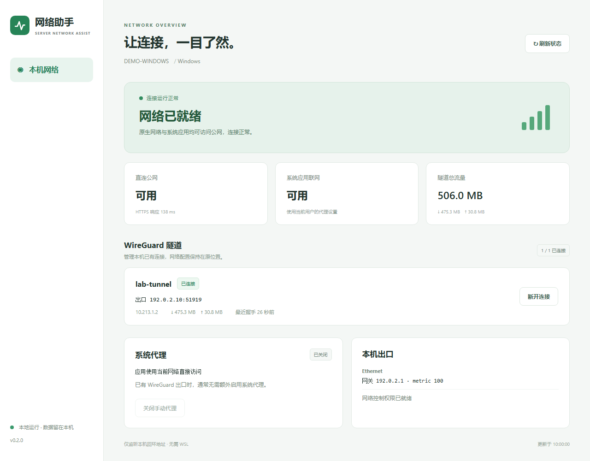
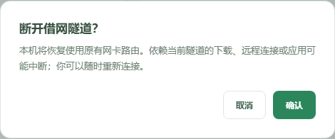

# Server Network Assist

一个面向小型实验室、工作室和家庭机房的自托管服务器网络协作台。它通过你明确添加的 SSH 主机执行连通性探测，让 Windows 或 Ubuntu/Linux 客户端经 Windows 或 Ubuntu/Linux 出口机使用 WireGuard 访问公网；Windows 使用原生网络栈，无需 WSL。可选择仅共享网络，或同时共享源机器的 HTTP/HTTPS 应用代理。断开后恢复原有路由与本方案修改的代理设置。

> 当前版本为 `0.2.0-alpha`。网络切换属于高风险运维操作，请先在可现场恢复的测试机上验证。不要把管理台直接暴露到公网。

## 功能

- SSH 主机清单、分组、跳板链和严格主机指纹锁定
- SSH、DNS、HTTPS 公网连通性分层探测
- 一台出口机向 1–32 台客户端提供可逆 WireGuard 借网
- 自定义 UDP 端口、隧道网段和控制面保留路由
- 120 秒切换确认窗口，复检失败自动回退
- systemd 定时维护；连续故障后停用隧道并恢复原路由
- Xterm.js 网页终端，支持可选 tmux 持久会话
- 本地加密凭据库、CSRF/Origin 防护、会话撤销、审计日志与 WebAuthn 通行密钥
- Angular Material 响应式界面，桌面、平板和手机均可使用
- 本机桌面面板：独立窗口、桌面快捷方式、隧道连接开关、握手与流量、Windows 系统代理诊断
- Windows 原生 WinNAT 出口；Windows/Ubuntu 四种方向的共享配置
- 源 HTTP/HTTPS 代理按需共享，通过隧道中继，修改前记录恢复信息

图文原理、交互路径示意和完整实践文章见 [项目博客](docs/blog/README.md)（本地打开 `docs/blog/index.html`）。新增共享能力的前提、作用范围与验证边界见 [跨平台共享与代理指南](docs/SHARING.md)。

## 桌面面板

安装后运行 `server-network-assist-desktop`。Windows 可通过安装程序创建“服务器网络助手”桌面快捷方式，双击即开；支持直接控制已经安装的 WireGuard 隧道。窗口关闭不会断开网络。面板所有资源本地提供，无需 WSL，也无需额外桌面运行库。

完整安装、升级及使用方式见 [桌面面板指南](docs/DESKTOP.md)。

桌面面板复用 **Framework7 9.1.3 的现成 iOS 组件**，支持深浅主题，所有样式随程序离线提供。组件来源、MIT 授权和设计师候选记录见 [UI 来源说明](docs/UI_SOURCES.md)。多主机管理台继续使用 Angular Material。

所有公开项目的统一博客入口、独立链接及后续新增项目方法见 [项目博客部署指南](docs/PROJECT_HUB.md)。

## 使用案例与截图

下面三个案例来自本项目的使用场景。截图由当前程序界面配合**演示数据**生成，不是生产服务器实录；主机名、地址、流量和延迟均为示例，不代表性能测试结果。`192.0.2.x` 是文档示例地址，实际部署请替换为自己的地址。点击截图可查看原图。

| 你的需求 | 使用入口 | 操作说明 |
| --- | --- | --- |
| Windows 浏览器打不开网页，但 WSL 可以联网 | 本机桌面面板 → 系统代理 | [案例一](#案例一windows-原生应用的代理故障排查) |
| Ubuntu 出口机为 Windows 和 Ubuntu 客户端提供网络 | 服务器管理台 → 网络借助 | [案例二](#案例二一台-ubuntu-出口机服务两种系统) |
| 在桌面查看连接、流量、握手并控制已有隧道 | “服务器网络助手”快捷方式 | [案例三](#案例三从桌面查看和控制已有隧道) |

### 案例一：Windows 原生应用的代理故障排查

我们在 Windows/WSL 混合环境中遇到过：WSL 能联网，Windows 应用却访问失败，原因是 Windows 用户仍启用了失效的本地手动代理。这是其中一种原因，不能仅凭 WSL 能联网就判断所有 Windows 故障都是代理问题。

1. 双击“服务器网络助手”，点击“刷新状态”，同时检查“直连公网”和“系统应用联网”。
2. 如下图，直连可用、系统应用不可用，且手动代理指向 `127.0.0.1:7897`，应检查对应代理服务是否仍在运行。隧道显示“已连接”并不等于应用一定可以联网。
3. 如果已不需要手动代理，点击“关闭手动代理”。程序会先备份当前用户代理配置再关闭开关；不会删除 PAC 或代理软件自身的配置。
4. 再次刷新，并在原先失败的 Windows 应用中重试。面板两项探测都变为“可用”后，还需确认目标网站或服务恢复。

[](docs/images/windows-proxy-diagnosis.png)

如果代理软件重新开启系统代理，请同步检查该软件。若直连也失败，继续排查出口、DNS 和路由，参见 [Windows 与 Ubuntu 兼容说明](docs/WINDOWS.md)。

### 案例二：一台 Ubuntu 出口机服务两种系统

适合实验室中“有一台 Ubuntu 可以上网，其他机器能通过 SSH 管理，但不能访问公网”的场景。Windows 客户端使用原生 WireGuard，Ubuntu 客户端使用 Linux 网络栈，Windows 不需要借助 WSL。

| 示例角色 | 系统 | 管理地址 |
| --- | --- | --- |
| Ubuntu 出口机 | Ubuntu/Linux | `192.0.2.10` |
| Windows 工作站 | Windows | `192.0.2.20` |
| Ubuntu 计算节点 | Ubuntu/Linux | `192.0.2.30` |

1. 在“主机与凭据”中添加三台主机，并通过可信渠道核对 SSH 指纹。进入“网络借助”，点击“探测全部主机”。
2. 确认出口机公网可用、各节点 SSH 可达，并按指南安装辅助程序。Windows 客户端还需要原生 WireGuard 和管理员 SSH 账号。
3. 创建方案，选择 Ubuntu 出口机及两个客户端，填写可达的出口地址、UDP 端口、无冲突的隧道网段，并保留 SSH/校园网等管理网络的路由。下图展示的是**待启用方案**，不表示已经完成联网验证。
4. 启用方案并等待 SSH 与公网复检；失败会自动回退。Windows 还应检查“系统应用联网”，避免手动代理影响应用访问。
5. 不再借网时，在管理台点击“断开并恢复原网络”，清理该方案的隧道和临时路由。

[](docs/images/mixed-network-profile.png)

这个示例使用 Ubuntu 出口；也可选择具备原生 WireGuard 和 WinNAT 的 Windows 出口。Windows 出口检测到已有 NAT 时会拒绝创建，保留 WSL/Docker 等原网络。新功能的系统前提和验证边界见 [跨平台共享指南](docs/SHARING.md)。

方案中还可选择“同时共享 HTTP/HTTPS 代理”：填写源机器的代理 IPv4/端口，客户端通过隧道访问它。Windows 修改 SSH 用户的系统代理；Ubuntu 配置新登录 shell、APT 和该用户已登录的 GNOME 会话，断开时恢复。默认“不共享源代理”保留客户端原有代理；这个选项不会绕过源机器的 VPN/TUN，也不会复制订阅、PAC 或认证信息。

### 案例三：从桌面查看和控制已有隧道

已经配置好 WireGuard 的机器，可以用桌面面板完成日常检查。它提供类似网络客户端的状态窗口；多主机管理和新建方案仍在服务器管理台完成。

1. Windows 双击桌面快捷方式“服务器网络助手”；源码安装后也可运行 `server-network-assist-desktop`。Ubuntu/Linux 可使用同一命令，操作权限见 [桌面面板指南](docs/DESKTOP.md)。
2. 查看两项联网探测、出口、最近握手和累计收发流量。流量是隧道当前运行周期的累计值，**不是实时网速**；面板每 30 秒自动刷新，也可手动刷新。

[](docs/images/desktop-overview.png)

3. 点击“断开连接”会出现确认框；取消后保持连接，确认后停止选中的已有 WireGuard 服务。需要恢复时点击“连接”，原隧道配置和私钥保留。

[](docs/images/disconnect-confirmation.png)

**关闭窗口不会断网。** 桌面连接开关只控制已有服务；要完整结束管理台创建的借网方案并清理临时路由，请使用管理台的“断开并恢复原网络”。当前桌面面板不包含 Clash 订阅、规则编辑或系统托盘菜单。

## 快速开始

要求：Windows 或 Linux 管理节点、Python 3.11+。被管理主机需要 SSH。Ubuntu/Linux 借网节点需要 systemd、WireGuard、`iproute2` 和 `iptables`；Windows 节点需要 WireGuard for Windows、PowerShell 5.1+ 和管理员 SSH 账号，作为出口还需要 WinNAT。升级后请为所有参与节点重新安装当前辅助程序。

Windows 原生安装、代理故障定位与回退见 [Windows 与 Ubuntu 兼容说明](docs/WINDOWS.md)。`v0.1.0` 发布包是旧版，不包含当前 Windows 支持和桌面面板；体验本文功能请从当前源码安装。

Ubuntu/Linux：

```bash
git clone https://github.com/2667741708/server-network-assist.git
cd server-network-assist
python3 -m venv .venv
. .venv/bin/activate
pip install .
server-network-assist init --data ./data
server-network-assist serve --data ./data --bind 127.0.0.1 --port 9180
```

Windows PowerShell：

```powershell
git clone https://github.com/2667741708/server-network-assist.git
cd server-network-assist
py -3 -m venv .venv
.\.venv\Scripts\python.exe -m pip install .
.\.venv\Scripts\server-network-assist.exe init --data ./data
.\.venv\Scripts\server-network-assist.exe serve --data ./data --bind 127.0.0.1 --port 9180
```

上面的命令启动服务器管理台。若要独立桌面窗口和 Windows 快捷方式，继续按 [桌面面板安装指南](docs/DESKTOP.md#windows-离线安装) 操作。

首次账号保存在 `data/initial-login.json`，权限应保持为仅当前用户可读。登录并安全保存恢复密钥后，建议删除这个一次性交付文件。

浏览器访问 `http://127.0.0.1:9180`。生产环境请使用 Caddy、Nginx 或其他反向代理提供 HTTPS，并设置精确的 `PANEL_ORIGIN`；通行密钥只在固定 HTTPS 来源下启用。

## 使用顺序

1. 在“主机与凭据”中添加加密凭据和 SSH 主机。
2. 读取 SSH 主机公钥，在可信渠道核对 SHA-256 指纹后保存。
3. 在“网络借助”中探测全部主机，选出公网可用的出口机。
4. 在出口机和客户端安装辅助程序，创建方案并选择端口、客户端和保留路由。
5. 启用后等待客户端通过 SSH 与公网复检；失败会自动回退。
6. 点击“断开并恢复原网络”，删除借网隧道和临时路由。

完整说明见：

- [安装与升级](docs/INSTALL.md)
- [使用手册](docs/USER_GUIDE.md)
- [网络借助原理与回退](docs/NETWORK_ASSIST.md)
- [安全模型](docs/SECURITY.md)
- [架构与开发](docs/ARCHITECTURE.md)
- [English README](README_EN.md)

## 开发

```bash
cd frontend
npm ci
npm test -- --watch=false
npm run build
cd ..
python scripts/build_frontend.py
python -m unittest discover -s tests -v
```

前端使用 Angular 22、Angular Material/CDK 与 Xterm.js；后端使用 aiohttp、AsyncSSH、SQLite、cryptography 和 WebAuthn。所有生产前端资源均随 Python 包本地提供，不依赖公共 CDN。

## 安全披露与贡献

请阅读 [SECURITY.md](SECURITY.md) 和 [CONTRIBUTING.md](CONTRIBUTING.md)。不要在 Issue、截图或日志中提交真实私钥、密码、恢复密钥、Cookie、内部 IP 清单或 SSH 配置。

## 许可证

本项目采用 [MIT License](LICENSE)。第三方组件及许可证见 [THIRD_PARTY_NOTICES.md](THIRD_PARTY_NOTICES.md)。
