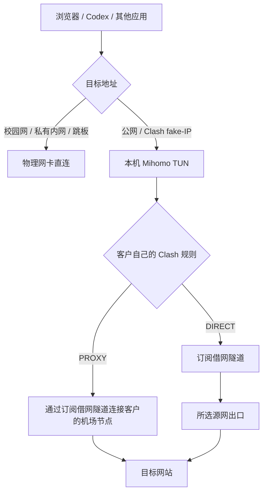

# 借网客户端与本机 Clash TUN 共存

## 408 已部署的操作命令

先通过客户客户端连接订阅节点，再在 **408 的终端**开启其已有 Mihomo 的 TUN：

```bash
sudo d408-tun enable
```

此命令检查当前订阅租约、验证配置、设置三分钟回退计时，并实测 GitHub 和 GitHub API；通过才取消回退。失败时恢复普通代理模式。

```bash
sudo d408-tun status
sudo d408-tun off
sudo d408-tun stop
```

`off` 关闭 TUN 并启动 408 的普通代理；`stop` 关闭这两个 Clash 服务。它们均不退出借网。要退出借网，在客户客户端点击“退出借网”：客户端先关闭属于当前借网节点的 TUN，清理路由和 DNS，再关闭专用 `sna...` WireGuard 隧道并释放租约。其他管理跳板隧道不会被这项退网操作停止。

这些 `d408-tun` 命令是 408 的部署适配命令，不可直接当作 Windows 或其他 Linux 主机的通用安装命令。开机后应先建立有效借网连接，再开启 TUN；此服务没有脱离租约单独启用开机启动。

## 客户端软件重启验收

在 **408** 执行：

```bash
sudo systemctl restart server-network-assist-client-1000.service
systemctl is-active server-network-assist-client-1000.service d408-mihomo-tun.service
```

此操作只重启客户后台，现有 Clash TUN 与有效借网连接保持运行。TUN 对后台服务使用 `Wants=`，避免后台重启通过 `Requires=` 连带停止 TUN；借网有效性仍由租约检查、源端撤销和客户端到期清理约束。主动“退出借网”仍先停止本节点拥有的 TUN，再停止客户 WireGuard。

2026-09-16 408 实际完成两次软件后台重启：后台 PID 变化，Clash PID 保持不变，操作系统 boot ID 未变；每次重启前后校园 TCP 22、GitHub/API HTTPS 200、续租与无重复规则检查通过。重启后使用客户快捷方式重新打开面板，不沿用旧面板端口或令牌。测试工具为 `scripts/verify_client_software_restart.py`。

**Windows 本机网络验收已中止，未通过。** 测试中安装客户隧道并自动适配 Clash 后，用户报告本机断网；随后禁止继续调整本机网络。后续仅在明确指定的服务器验收，本机不执行恢复、重连或 TUN 切换。已撤销本次 Windows 测试账号；本机测试后台停用尝试的管理员授权被取消，不能声称已停用。Windows 原网络、TUN 共存和软件重启须分别验证，不能引用 Ubuntu 408 的结果记为通过。

## 数据路径



“DIRECT”在这里表示不使用机场节点；当前电脑的外网基础连接仍由订阅借网提供。客户保留自己的机场订阅、节点和规则。源网若另有自己的代理设置，实际出口还会受源网策略影响。

## 兼容机制

- 本机 Clash 出站使用标记 `0xd40a`，优先查主路由表，避免再次进入本机 TUN 形成循环。
- 校园与私有网络优先查主路由表；408 额外直连 `202.206.240.0/24` 校园 DNS 网段。
- 其余 IPv4 流量进入独立表 `20482` 的 `d408-tun`。关闭时仅删除本适配器登记的规则。
- TUN 使用 mixed 栈、MTU 1380；关闭 Mihomo 的自动路由和自动重定向，由适配器管理分流。
- TUN 开启时 DNS 由 `198.19.0.2` 接管，fake-IP 地址必须进入 Clash。408 的本机 `client-routing.json` 排除 `198.18.0.0/15`，避免 WireGuard 抢走它自己 Clash 的 fake-IP；已运行的旧配置需退出后重新连接才能应用。这是本机适配，不是所有客户的默认：没有本机 Clash 的客户可能需要把源机 DNS 返回的 fake-IP 交回源机处理，不能一律绕过。
- 408 的 DNS 引导及通用解析使用固定 IP 的 DoT，防止源机 Clash 返回它自己的 fake-IP；机场订阅指定的专用 nameserver-policy 保留。
- 普通代理模式不强制绑定物理网卡，让连接使用当前可用的借网路由。
- 关闭 TUN 恢复当前借网网卡的 DNS；退出借网后由 WireGuard 的关闭流程撤销其 DNS 设置。

本次适配针对 IPv4；408 的 Mihomo TUN 配置关闭 IPv6。Windows 可按本机直连策略配置 fake-IP 范围，但 Windows TUN 的实际共存测试须在安装后的 Windows 客户端上另行完成。

客户安装流程新增 30 秒源机握手检查：服务启动成功还不能认定借网成功，必须确认对应源机公钥的近期握手。超时则停止本次新建隧道、释放租约；停止失败明确报告回退未完成。握手通过也不能替代公网 HTTPS 与校园访问验收。

## 验证与恢复

部署前的原配置备份位于 408：

```text
/var/backups/d408-network/20260916T192733-customer-tun
```

排查时不要输出含密钥的 WireGuard 配置或含机场订阅凭据的完整 YAML。

```bash
ip rule show
ip route get 1.1.1.1
ip route get 1.1.1.1 mark 0xd40a
ip route get 10.20.32.12
resolvectl status d408-tun
curl --noproxy '*' -4 -I --max-time 25 https://github.com
```

TUN 工作时第一条公网路由查询应指向 `d408-tun`，带标记的查询应指向当前 `sna...`，5080 内网查询应指向 `enp4s0`。遇到异常先执行 `sudo d408-tun off` 回到普通代理模式。

现有实现分别见 `scripts/d408_customer_tun.py`、`src/server_network_assist/client_tunnel.py`，真实断开、重连、续期验证工具为 `scripts/verify_d408_customer_tun.py`。Mihomo 字段依据：[官方 TUN 文档](https://wiki.metacubex.one/config/inbound/tun/)。
