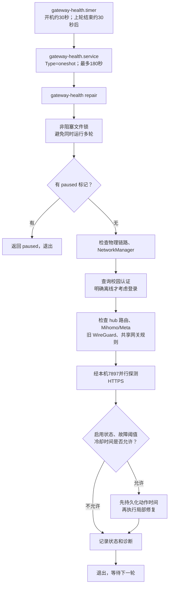
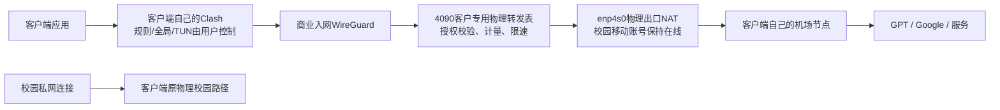

# gateway-health 自愈程序：实现与命令大全

按请求保留文件名 `gateway-helth命令大全.md`；实际程序及服务名称均为 **gateway-health**，命令中不要拼成 helth。

**以下命令在 4090 Ubuntu 终端逐条执行，不在 Windows 客户机执行。本文发布只归档独立守护工具，不部署新的转发模式、不切换服务器网络。**

## 常用命令放在最顶部

| 目的 | 命令 | 注意 |
| --- | --- | --- |
| 最近一轮结果 | `sudo gateway-health status` | 历史快照，查看 time，不代表刚完成探测 |
| 当前检查，不修网络 | `sudo gateway-health check` | 暂停时返回 paused；锁忙时返回 Check already running |
| 立即尝试自愈 | `sudo gateway-health repair` | 会改本机网络；仍受暂停、锁、故障阈值和冷却限制 |
| 持久暂停自愈 | `sudo gateway-health pause` | 不退出网络；不取消已经运行的一轮 |
| 恢复自愈 | `sudo gateway-health resume` | 清除 paused，并 enable --now timer，不保证网络已恢复 |
| 定时器状态 | `systemctl status gateway-health.timer --no-pager` | 看是否 waiting 及下一次触发 |
| 查看下次触发 | `systemctl list-timers --all gateway-health.timer` | 每轮结束约 30 秒后运行，不是固定每 30 秒结束 |
| 检查任务状态 | `systemctl status gateway-health.service --no-pager` | oneshot，结束后 inactive 正常 |
| 启动一次后台修复 | `sudo systemctl start gateway-health.service` | 相当于 service 调用 repair，可能等待本轮结束 |
| 停止当前检查任务 | `sudo systemctl stop gateway-health.service` | 杀掉该任务进程组，不停止已经运行的隧道 |
| 临时停止未来调度 | `sudo systemctl stop gateway-health.timer` | 自启仍保留；不会取消正在执行的 service |
| 启动未来调度 | `sudo systemctl start gateway-health.timer` | 不清除 paused 标记 |
| 启用自启并运行定时器 | `sudo systemctl enable --now gateway-health.timer` | 不清除 paused；通常用 resume 更完整 |
| 关闭定时器及自启 | `sudo systemctl disable --now gateway-health.timer` | 正在执行的 service 仍需单独 stop |
| 最近一小时日志 | `sudo journalctl -u gateway-health.service --since '1 hour ago' --no-pager` | 日志与 status 一起看 |
| 查近期错误 | `sudo journalctl -u gateway-health.service -p warning --since '1 hour ago' --no-pager` | 没有日志不等于所有探测成功 |
| 清除 service 失败状态 | `sudo systemctl reset-failed gateway-health.service` | 不执行修复，也不修正代码/配置错误 |
| 查看实际单元定义 | `systemctl cat gateway-health.service gateway-health.timer` | 查清楚实际 ExecStart，避免操作错版本 |
| 校验已安装单元 | `sudo systemd-analyze verify /etc/systemd/system/gateway-health.service /etc/systemd/system/gateway-health.timer` | 不切换网络 |
| 重新载入修改后的单元 | `sudo systemctl daemon-reload` | 只用于确实修改了 unit 后；普通启停无需执行 |
| 退出旧自愈部署并局部回滚 | `sudo gateway-health-rollback` | 仅原 4090 部署适用；会恢复部分 NetworkManager 字段，详见后文 |

暂停不是退网，resume 也不是启动客户入网。它们控制的是**源端自愈策略**。

## 1. 来源：这是之前留下的自愈程序吗？

**是之前的独立网关自愈工具，并非本次商业客户端新增的进程。**

- 本地历史目录：`network_autorepair_20260909`，其部署记录日期为 **2026-09-09**。
- 4090 安装位置：`/usr/local/sbin/gateway-health`，由系统级 timer 调度。
- 发布前读取了 4090 实际运行的源码；统一换行、去除文件尾空白后，与历史目录中的 `gateway-health.py` 相同。
- 旧记录包含 NetworkManager 重连、校园移动账号恢复、旧 WG 组网和共享出口自愈；早于现有商业订阅客户端。

目前可确认独立工具的目录和部署来源，**不能仅凭这份代码断言它来自某个其他 GitHub 仓库**。本仓库本次单独归档它，不把历史账号配置、WireGuard 私钥或代理订阅混进开源代码。

源码：[gateway-health.py](tools/gateway-health/gateway-health.py)；单元：[service](tools/gateway-health/gateway-health.service)、[timer](tools/gateway-health/gateway-health.timer)；原有隔离测试：[test_health.py](tools/gateway-health/test_health.py)。

## 2. 它是如何运行的？

它没有一个一直驻留的 Python 主循环。常驻调度由 systemd 完成，每次启动一个检查/修复进程，检查结束后退出：



### 调度和进程约束

当前 unit 中 `OnBootSec=30`、`OnUnitInactiveSec=30`、`AccuracySec=2`；上一轮耗时、调度精度及冷却都会影响恢复时间。之前停 Mihomo 约 10 秒后被恢复，是碰巧赶上下一轮，不代表固定 10 秒或 30 秒必然恢复。

service 使用 `Type=oneshot`、`TimeoutStartSec=180`、`KillMode=control-group`、`UMask=0077`。因此：

- service 正常结束后显示 **inactive / static** 可以是正常情况；应同时检查 timer 和最近一次执行结果。
- 锁忙会直接返回 `Check already running`，退出码 0 不等于本轮完成了所有检查。
- 180 秒是单轮最长运行约束，不是网络恢复时间承诺。
- 检查路径仍会读配置、创建锁文件；“只读 check”指不执行网络修复，不是文件系统完全零写入。

### 数据在哪里？

| 路径 | 用途 |
| --- | --- |
| `/usr/local/sbin/gateway-health` | Python 控制器 |
| `/etc/gateway-health.json` | 本机接口、网关、旧隧道、受管规则和原登录工具路径；原部署权限0600 |
| `/var/lib/gateway-health/lock` | 防止并发运行的文件锁 |
| `/var/lib/gateway-health/state.json` | 故障计数、最近动作时间、登录退避次数 |
| `/var/lib/gateway-health/status.json` | 最近一轮 repair 的诊断快照 |
| `/var/lib/gateway-health/paused` | 持久暂停标记，重启后仍有效 |
| `/var/lib/gateway-health/installation.json` | 原安装时的回滚元数据 |
| `/var/backups/gateway-health-20260909-223934` | 历史部署记录中的4090基线备份，使用前确认仍存在 |

状态目录原部署为0700。不要上传真实 accounts 文件、WG 配置、Mihomo 配置或这些备份到公开仓库。

## 3. 各项自愈的实现和边界

| 检查对象 | 实际实现 | 限制/冷却 |
| --- | --- | --- |
| 物理链路 | 读取配置接口的 carrier；没有链路则 waiting-for-carrier 并退出本轮 | 不能修复拔线、供电和校园交换设备 |
| 有线连接 | 有carrier但nmcli不是已连接状态，尝试按配置UUID connection up | 同类动作120秒 |
| 校园账号 | 以原用户a运行netlogin.py current-status，核对账号、运营商、IP | 未知状态不登录；其他账号已在线不踢下线 |
| 离线登录 | 故障计数达到2后调用login-stdin，密码来自原私有accounts文件 | 登录失败后60、120、240、480、960秒至最多1800秒退避 |
| hub外层路由 | 检查指定Endpoint是否走原校园接口/网关，必要时修复其/32路由 | 同类动作60秒，避免隧道外层递归入隧道 |
| Mihomo及Meta | 对enabled核心检查服务和Meta是否存在，缺失时reset-failed后restart | 同类动作120秒；disabled则本守护跳过 |
| 旧WG服务/接口 | 对enabled的wg-quick服务检查存在性；配置peer不一致则syncconf | 服务缺失/peer同步120秒；不把对端关机当全组重启理由 |
| WG keepalive | 检查运行peer并设置25秒 | 同一peer动作默认300秒；不是网站速度或延迟阈值 |
| Cloud旧wg0可达 | 本机认证正常且目标TCP探测失败时，达到故障阈值后syncconf | 阈值3、冷却300秒；不拆接口 |
| 旧共享网关规则 | 只对配置groups及enabled网关服务检查命名iptables链、跳转 | 链使用iptables-restore --noflush，60秒冷却，不全局flush |
| 旧共享路由 | 检查各group专用表默认路由及fwmark/priority规则，缺项补回 | 60秒冷却，不替换整个主路由表 |
| IPv4转发 | 有enabled受管group时，必要时设net.ipv4.ip_forward=1 | 默认动作冷却300秒 |
| HTTPS出口 | 显式经127.0.0.1:7897探测配置的两个站点 | 单请求connect4秒、最多8秒；证书校验开启 |
| 代理不响应 | 校园预期账号在线、所有HTTPS目标连续3轮失败且核心enabled时restart | 冷却600秒；不自动换机场节点 |

源码细节：校园登录计数在正确会话在线时清零，未知/其他会话分支不会自动清零；因此“阈值2”不应描述成任意情况下严格连续两轮离线。wg0的计数也有跳过分支；HTTPS动作的failed=false则明确清零。

账号密码用stdin传给旧登录工具，不写入argv；日志只记录动作名及退出码。原程序登录payload的`service='1'`属于该旧登录工具约定，不是适用于任意校园的通用运营商编号。

动作执行前先保存last_action，防止进程被中途终止后反复重启；这份关键节流状态写失败会阻止动作，不承诺所有文件写入失败都可忽略。repair结束后status诊断文件写失败被捕获，避免仅辅助诊断失败导致已完成修复报错。

退出码0只代表调用成功，校园登录在下一轮核验会话，网站/隧道仍需要真实TCP及HTTPS验收。状态里可能记录修复前的检查结果，不要把某一个false直接等同于修复后现状。

## 4. 如何维护，又不被自愈强行重新打开？

### 临时维护全部受管项目

持久暂停未来轮次，并停止当前已启动的检查：

```bash
sudo gateway-health pause
```

```bash
sudo systemctl stop gateway-health.service
```

这不会关闭当前WG、代理或共享网络。timer可以继续触发，但新轮次返回paused；需要减少调度时再单独stop timer。

维护完成恢复：

```bash
sudo gateway-health resume
```

```bash
systemctl list-timers --all gateway-health.timer
```

```bash
sudo gateway-health status
```

等待新的time和实际探测结果；resume的输出不是验收通过。

### 仅明确停用Mihomo，保留其他自愈

**下列动作会改变核心自启；当前商业客户仍依赖Meta，执行会切断其公网出口。必须在未来物理转发模式部署并验收后，才可把它作为“关源代理仍保留客户网络”的流程。**

先pause并停止当前检查，然后对核心disable --now，再resume：

```bash
sudo gateway-health pause
```

```bash
sudo systemctl stop gateway-health.service
```

```bash
sudo systemctl disable --now mihomo.service
```

```bash
sudo gateway-health resume
```

本守护看到核心disabled会跳过缺失核心恢复，且不会触发HTTPS故障重启。disabled不是mask，其他单元依赖、Clash GUI或管理员start仍可能启动它；切换设计需要检查所有启动来源，不能认为disable就绝对无法运行。

恢复当前原先的enabled状态及运行：

```bash
sudo systemctl enable --now mihomo.service
```

```bash
ip address show dev Meta
```

```bash
sudo gateway-health status
```

**只做短时实验、不想改核心自启**：应暂停守护、停止当前检查，再stop核心，恢复时start核心和resume。远程停出口前安排独立救援；不能只执行systemctl stop mihomo并认为会一直关闭。

### 停止本工具和开机自愈

逐条执行pause、disable --now timer、stop service。注意此流程退出的是自愈，不是退出客户组网：

```bash
sudo gateway-health pause
```

```bash
sudo systemctl disable --now gateway-health.timer
```

```bash
sudo systemctl stop gateway-health.service
```

以后用resume恢复，它会启用timer自启。

## 5. gateway-health-rollback并不是普通退网命令

历史部署另有root脚本`/usr/local/sbin/gateway-health-rollback`。它读取installation.json和备份目录，停用新timer/service、创建paused；只在当前NetworkManager字段仍等于原安装值时恢复那些字段，并在旧wg-fleet-repair仍转调本工具时恢复旧文件。

它不恢复整份WG或防火墙，不删除现有隧道，不回滚之后的peer编辑；旧watcher保持禁用，避免重新出现互相重启。

该脚本含原机器固定连接UUID，依赖原回滚元数据。因此本次不把它作为可安装到任意主机的通用工具发布。只有核对原4090的安装元数据、备份和管理员后续修改后，才执行：

```bash
sudo gateway-health-rollback
```

## 6. 4090关闭代理、客户自己开启机场代理，该怎么实现？

**需要把“带宽转发”和“源端代理”拆开。仅暂停gateway-health或停Mihomo无法实现。以下为改造方案，尚未部署到当前商业中继。**

目标链路：



4090提供可上网的物理宽带；客户Clash通过它连接自己的机场，然后访问目标。4090自身直接访问GPT可以受限，并不妨碍这条设计，只要4090物理出口能连接客户所选机场。

必须完成的改造：

1. **新增源网出口策略**，例如“使用源网代理”和“仅物理宽带、客户自主代理”。由服务端显式授权和配置，客户端订阅展示能力，不暗中改变客户选择；不能把名字当作现已可用命令。
2. **独立策略路由**：对sna-commercial进入的授权客户地址选择专用物理出口表，使用原网关/接口；优先级避开Mihomo截获规则，保留回程和既有管理Endpoint。选未占用的表号/优先级，不能复用旧工具受管表并互相覆盖。
3. **有所有权的防火墙/NAT**：物理模式允许授权客户经enp4s0出网，并在此接口masquerade；代理模式保留Meta出口。现有`oifname != Meta drop`必须按策略调整，不能简单删除全部隔离规则。
4. **保留商业约束**：租约、即时撤销、流量计量、限速、客户隔离、管理地址保护继续运行。关闭源端代理不应关闭计量中继或控制服务。
5. **独立DNS路径**：物理模式不用已停止的源端Mihomo DNS/fake-IP；客户需能解析机场节点，可用受控的物理出口DNS/加密DNS。核验DNS引导、IPv4/IPv6、源端和客户端TUN的路由组合。
6. **守护尊重人工选择**：当前守护已跳过disabled核心；未来更适合显式proxy_desired状态，保持核心自启和用户期望状态一致。legacy groups的规则恢复不得覆盖新商业出口，代理模式才将Meta/7897失效判为必须修复。
7. **恢复和退出**：策略切换、租约撤销、客户退出仅清理本工具owned项目；失败回退。校园私网、校园登录、热点、其他Clash和管理路径保持其原行为。
8. **实际验收**：源端核心/Meta持续关闭且未被守护恢复；客户rule/global/direct及TUN开关矩阵，实际HTTPS/模型请求，WG流量与物理出口证据；校园SSH双向，客户端退出恢复指纹，服务重启、租约撤销和限速计量。直连模式只承诺源宽带本来可访问的网站，不承诺直连访问受限GPT。

旧2026-09-09部署记录中，D408经旧wg-d408借物理出口、自身代理可选，说明类似结构以前做过；**不是当前商业sna-commercial已经支持该模式的证明**。2026-09-17状态还显示旧wg-d408服务已被operator disabled，不能照旧记录直接当作当前可用线路。

WireGuard官方说明可通过多路由表/策略路由分离隧道路径，并需避免Endpoint递归；本文方案参考这一机制，不直接搬运其示例来改现网。[WireGuard路由说明](https://www.wireguard.com/netns/)

## 7. 本次核验及开源范围

- 发布前4090只读状态：timer active/enabled，oneshot service inactive/static，Mihomo active/enabled。
- 本次在4090的用户临时目录运行原有8项mock隔离测试，全部通过；systemd-analyze verify对归档service/timer校验退出码0。未调用真实repair或启停现网服务。
- 最近status报告移动预期账号在线、百度和Google代理探测成功、actions为空。旧d408-gateway检查存在false，不声称所有遗留项目健康；time是该轮快照时间。
- 历史部署文档的故障注入、namespace测试和2026-09-17停代理实验是分别发生的历史证据，不冒充本次再次执行。
- 本次归档实际源码、两个systemd单元、原8项隔离测试及说明；不包含运行配置、账号、订阅、私钥、安装器或其他待提交的产品改动。
- 该控制器使用Linux fcntl、NetworkManager、iptables及固定旧用户/接口约定，**不是Windows通用安装包或完整商业中继**。其他机器需要重新配置和审核，不可直接启用这些旧规则。

本文件说明程序和命令；仅物理转发模式的代码、部署和真实验收仍待实施。
