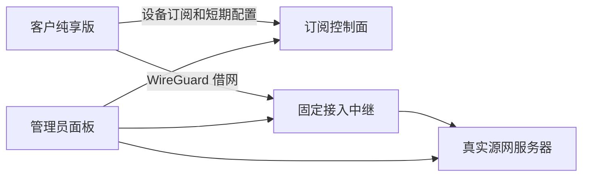
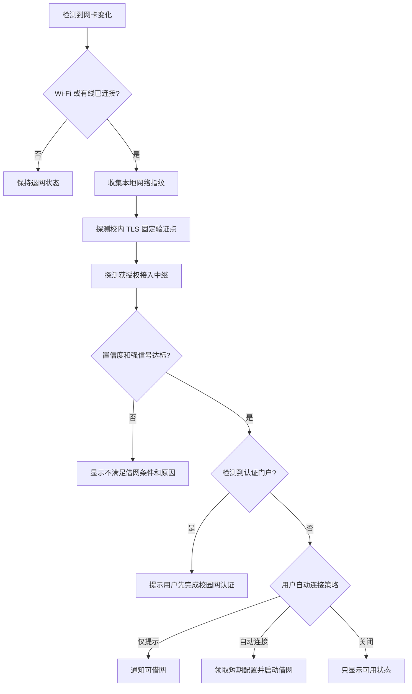

# 借网客户端软件开发规划表

## 1. 项目目标

| 项目 | 规划 |
| --- | --- |
| 产品名称 | Server Network Assist Client（客户纯享版，暂定名） |
| 核心目标 | 客户像使用机场订阅一样填写订阅地址，选择获授权线路，一键借网、退网，查看延迟、可用性、速度、流量和有效期。 |
| 支持系统 | Windows 10/11、Ubuntu Desktop；后续可扩展其他 Linux 桌面。 |
| 管理原则 | 客户端只拥有使用线路的最小权限，不能获得服务器 SSH、跳板、管理面板、Clash Controller 或其他客户信息。 |
| 网络原则 | 所有借网操作必须可逆；退网后恢复原默认路由、DNS、代理和本软件创建的临时配置。 |
| 自动连接原则 | 根据校园局域网网络指纹判断是否具备接入条件；SSID 只作为辅助证据，不把 `iyanda` 或 `iYanDa-Dormitory` 当成唯一条件。 |

## 2. 产品边界

### 2.1 客户端允许的能力

| 能力 | 说明 |
| --- | --- |
| 添加订阅 | 输入、粘贴或扫描订阅地址。 |
| 更新订阅 | 手动更新、启动时更新、按安全周期后台更新。 |
| 设备注册 | 当前设备生成独立密钥并向订阅控制面登记。 |
| 查看线路 | 显示线路名称、延迟、可用性、负载、限速、到期时间和剩余流量。 |
| 选择线路 | 只能选择管理员授权给当前客户及设备的线路。 |
| 启动借网 | 获取短期配置、建立隧道、保护管理路由、验证出口。 |
| 退出借网 | 停止隧道，恢复原路由、DNS和代理，清理临时状态。 |
| 自动连接 | 在确认当前网络能够接入校园局域网和指定接入点后，提示或自动借网。 |
| 延迟检测 | 分别显示接入点 RTT、隧道握手状态和借网后公网探测结果。 |
| 流量显示 | 显示实时上传/下载速率、累计流量、套餐已用/剩余流量。 |
| 状态通知 | 连接、断开、订阅失效、额度不足、网络变化和恢复失败通知。 |
| 开机启动 | 用户可选择关闭、只启动客户端、启动并按规则自动连接。 |

### 2.2 客户端禁止获得的内容

| 禁止内容 | 落实方式 |
| --- | --- |
| SSH 地址、账号、密码和私钥 | 不进入订阅响应；客户端协议不提供 SSH 字段。 |
| 跳板机和内部管理链路 | 由服务端控制面管理，不下发客户端。 |
| 管理面板地址和管理员会话 | 客户订阅域与管理员域隔离，使用不同鉴权体系。 |
| Clash Controller 密钥 | 不进入客户客户端。 |
| 服务端 WireGuard 私钥 | 始终只保存在接入节点。 |
| 其他客户的设备、流量和线路 | 所有查询按客户和设备进行服务端授权过滤。 |
| 创建、修改或删除源网服务器的权限 | 客户 API 只有订阅、探测、连接凭据领取和设备自助撤销能力。 |
| 任意执行命令能力 | 客户协议使用固定结构化请求，不提供终端、SSH 或通用命令接口。 |

## 3. 推荐网络架构



| 组件 | 职责 |
| --- | --- |
| 客户纯享版 | 网络识别、订阅、线路选择、借网、退网、状态和流量展示。 |
| 订阅控制面 | 客户授权、设备注册、签名订阅、短期凭据、额度和到期检查。 |
| 固定接入中继 | 暴露给客户的唯一网络入口、WireGuard peer 管理、隔离、限速和计量。 |
| 真实源网服务器 | 提供实际出口，不向客户公开控制方式。 |
| 管理面板 | 管理客户、设备、套餐、线路、中继、源网服务器、撤销和审计。 |

客户端建立网络连接时必然需要知道一个可达的 IP 或域名，因此不能在网络层隐藏其直接连接的入口。如果需要隐藏真实源网服务器，客户端必须只连接固定接入中继，由中继转发到真实源网服务器。

## 4. 订阅系统

### 4.1 订阅地址

```text
https://whm12.art/network-assist/subscription/<高熵设备令牌>
```

| 要求 | 规划 |
| --- | --- |
| 令牌 | 使用高熵随机令牌；数据库只保存不可逆摘要。 |
| 传输 | 仅允许 HTTPS；禁止降级到 HTTP。 |
| 设备绑定 | 首次使用时注册设备公钥；可配置单客户最大设备数。 |
| 有效期 | 订阅令牌可长期但可撤销；实际连接配置必须短期有效。 |
| 签名 | 响应使用服务端签名；客户端内置并固定验证公钥。 |
| 重放保护 | 响应包含设备 ID、签发时间、过期时间和随机 nonce。 |
| 更新 | 支持 ETag/版本号；旧配置过期后不能继续新增连接。 |
| 日志 | 不在普通日志中记录完整订阅令牌。 |

### 4.2 订阅内容

| 字段 | 是否下发 | 说明 |
| --- | --- | --- |
| 客户编号、设备编号 | 是 | 使用不可猜测的内部标识。 |
| 线路显示名称 | 是 | 不包含内部主机名和机房拓扑。 |
| 接入中继域名/IP | 是 | 建立连接必需。 |
| WireGuard 服务端公钥 | 是 | 不能反推出服务端私钥。 |
| 设备隧道地址 | 是 | 每台设备独立分配。 |
| DNS、AllowedIPs、MTU | 是 | 客户端建立隧道所需。 |
| 速度上限和流量额度 | 是 | 用于展示；最终强制执行在服务端。 |
| 到期时间 | 是 | 客户端展示并提前提醒。 |
| 自动连接策略 | 是 | 包括允许的网络指纹和用户选择。 |
| SSH、跳板和管理凭据 | 否 | 永不进入客户协议。 |
| 真实源网服务器地址 | 否 | 使用中继架构时不下发。 |
| 服务端私钥 | 否 | 永不离开服务端。 |

### 4.3 设备生命周期

| 阶段 | 操作 |
| --- | --- |
| 注册 | 客户端本地生成设备密钥，只上传公钥和最小设备信息。 |
| 授权 | 控制面检查套餐、设备数量、到期时间和线路权限。 |
| 连接 | 为设备签发短期配置或启用对应 peer。 |
| 续期 | 在线且仍满足授权条件时更新短期配置。 |
| 暂停 | 管理员或额度系统禁止新连接并停用 peer。 |
| 撤销 | 单独撤销设备令牌和 peer，不影响同一客户其他设备。 |
| 删除 | 保留必要审计和计费汇总，清除可识别设备凭据。 |

## 5. 校园局域网网络指纹识别

### 5.1 识别原则

`iYanDa-Dormitory`、`iYanDa` 等 SSID 可以变化，也可能被他人伪造；有线连接没有 SSID。因此自动连接不能依赖名称匹配，而应使用多项可验证信号组成“校园网络指纹”。

### 5.2 可用信号

| 信号 | 可信度 | 用途 |
| --- | --- | --- |
| 已保存且用户信任的 Wi-Fi 配置 | 中 | 判断系统确实连接过该网络，不自动使用未知密码。 |
| SSID | 低 | 只作为界面提示和弱加分项。 |
| BSSID/AP MAC | 中 | 可用于已知校园 AP 范围，但不能单独决定，因为 AP 会扩容、漫游且 MAC 可伪造。 |
| 默认网关 IP | 中 | 识别常见校园子网；网段调整后可由订阅更新。 |
| 默认网关 MAC/OUI | 中 | 辅助识别校园网络设备厂商和已登记网关。 |
| DHCP 分配网段 | 中 | 判断地址是否位于管理员下发的校园网段集合。 |
| DHCP 域、DNS 搜索后缀 | 中 | 作为校园 DHCP 指纹，不能单独信任。 |
| DNS 服务器地址 | 中 | 判断是否使用已知校园 DNS。 |
| 校内不可公网访问的探测点 | 高 | 检查 TCP/HTTPS 是否仅在校园局域网可达。 |
| TLS 固定证书的校园探测服务 | 高 | 使用证书公钥固定验证，防止伪造响应。 |
| 指定接入中继可达性 | 高 | 直接验证客户端是否能访问允许借网的入口。 |
| 校园认证门户特征 | 中 | 判断当前是否需要先完成校园网认证。不得自动提交账号密码。 |
| 路由路径/TTL 特征 | 低至中 | 作为辅助信息，不能单独授权。 |

### 5.3 推荐判定流程



### 5.4 判定规则

| 规则 | 要求 |
| --- | --- |
| 强信号门槛 | 至少成功验证一个 TLS 固定的校内探测点或获授权接入中继。 |
| 综合评分 | 网段、网关、DNS、BSSID、DHCP 域和 SSID只用于提高或降低置信度。 |
| 禁止条件 | 只有 SSID/BSSID 匹配而强探测失败时，不允许自动借网。 |
| Wi-Fi | Windows 使用 WLAN API，Ubuntu 使用 NetworkManager；只自动连接系统已保存且用户允许的配置。 |
| 有线 | 根据 DHCP、默认路由、校内探测点和接入中继判断，不要求存在 SSID。 |
| 认证门户 | 只提示和打开认证页；不从订阅读取或自动填写校园网账号密码。 |
| 网络切换 | 网关、接口或地址变化时立即重新判断；必要时先退网再重新连接。 |
| 隐私 | 默认只向控制面上报判定结果和必要诊断，不上传完整附近 Wi-Fi 列表。 |

### 5.5 网络指纹配置示例

```json
{
  "campus_network": {
    "trusted_subnets": ["10.0.0.0/8"],
    "dns_servers": ["10.10.0.53"],
    "wifi_name_hints": ["iYanDa", "iYanDa-Dormitory"],
    "https_probes": [
      {
        "url": "https://campus-probe.example.internal/health",
        "spki_sha256": "<certificate-public-key-pin>"
      }
    ],
    "required_relays": ["relay-campus.example.internal:51820"]
  }
}
```

此配置中的 SSID 仅用于提示。最终允许借网仍以证书固定探测点或接入中继可达为准。

## 6. 自动连接策略

| 模式 | 行为 |
| --- | --- |
| 完全关闭 | 不进行后台自动借网，只响应手动操作。 |
| 仅提示 | 网络指纹满足条件时通知“当前网络可以借网”，由用户确认。 |
| 自动连接 | 网络指纹满足条件且订阅有效时自动连接。 |

自动连接还应支持：

- 指定优先线路和备用线路。
- Wi-Fi和有线分别设置策略。
- 计费网络/移动热点不自动连接。
- 电池模式可关闭持续探测。
- 连接失败指数退避，避免反复修改路由。
- 用户手动退网后，在当前网络会话内不立即自动重连。
- 离开受信网络、订阅撤销或服务端要求下线时自动退网。
- 退网失败时显示显著警告并提供“一键恢复原网络”。

## 7. 借网流程

| 步骤 | 客户端动作 | 服务端动作 |
| --- | --- | --- |
| 1 | 检查订阅签名和有效期 | 返回当前授权摘要。 |
| 2 | 识别校园局域网网络指纹 | 无。 |
| 3 | 探测线路延迟和接入可达性 | 返回不含内部拓扑的线路状态。 |
| 4 | 保存原默认路由、DNS、代理和接口状态 | 校验客户、设备、额度和线路权限。 |
| 5 | 请求短期连接配置 | 启用或更新该设备 peer。 |
| 6 | 创建 WireGuard 接口和保留路由 | 设置隔离、限速和计量。 |
| 7 | 建立隧道 | 转发到获授权源网出口。 |
| 8 | 检查握手、DNS、HTTPS 和出口 | 记录连接审计。 |
| 9 | 验证失败时自动回滚 | 停用失败 peer 或释放临时授权。 |

## 8. 退网和恢复流程

| 步骤 | 要求 |
| --- | --- |
| 停止流量接管 | 停止当前 WireGuard/TUN 接口。 |
| 恢复路由 | 只恢复本次连接前保存且由本软件改变的路由。 |
| 恢复 DNS | 恢复原网卡 DNS 与搜索域。 |
| 恢复代理 | 恢复本软件修改前的系统代理，不覆盖其他软件后续合法修改。 |
| 清理临时配置 | 删除临时接口、路由、锁和短期配置。 |
| 服务端下线 | 通知控制面停用或回收设备 peer。 |
| 复检 | 验证当前局域网、DNS和原出口状态。 |
| 异常恢复 | 系统崩溃或断电后，下次启动读取事务日志并继续回滚。 |

## 9. 延迟与可用性检测

| 指标 | 含义 |
| --- | --- |
| 接入延迟 | 客户端到接入中继的 TCP/UDP 往返时间。 |
| 握手时间 | WireGuard 最近一次成功握手时间。 |
| 隧道延迟 | 通过隧道访问受控探测点的延迟。 |
| DNS 可用 | 通过选定线路解析测试域名是否成功。 |
| HTTPS 可用 | 通过选定线路访问 204/健康检查端点。 |
| 出口一致性 | 服务端返回的线路标识是否与授权线路一致；无需暴露真实源网服务器。 |
| 丢包与抖动 | 多次小探测计算，不使用一次结果下结论。 |

界面必须区分“接入点可达”“隧道已握手”“公网可用”，不能只显示一个笼统的绿色状态。

## 10. 服务端限速、流量和隔离

| 能力 | 方案 |
| --- | --- |
| 下载限速 | Linux 接入中继使用 `tc` HTB/CAKE 等按设备或客户 class 限速。 |
| 上传限速 | 在中继入站方向使用 IFB 或 nftables meter/tc 组合限制。 |
| 月流量 | 按独立 WireGuard peer 计量，汇总到客户账期。 |
| 设备数 | 控制面限制同时激活和已注册设备数量。 |
| 到期 | 到期后停止签发短期配置并停用 peer。 |
| 超额 | 支持断网、降速或管理员配置的宽限策略。 |
| 客户隔离 | nftables 禁止客户隧道地址互访和访问管理网段。 |
| 管理面隔离 | 客户流量不能访问 SSH、数据库、控制面管理端口。 |
| 防绕过 | 限速和授权在服务端执行；客户端显示值不能作为执行依据。 |

套餐示例：

| 项目 | 示例值 |
| --- | --- |
| 下载上限 | 20 Mbps |
| 上传上限 | 5 Mbps |
| 月流量 | 100 GB |
| 最大设备数 | 2 |
| 到期时间 | 2026-12-31 |

## 11. 客户纯享版界面

| 页面 | 内容 |
| --- | --- |
| 订阅 | 输入/扫描订阅地址、更新、签名状态、客户套餐和到期时间。 |
| 线路 | 线路名称、延迟、可用性、负载、速度上限和选择按钮。 |
| 连接 | 一键借网/退网、握手、实时速率、累计流量、剩余额度和恢复入口。 |
| 自动连接 | Wi-Fi/有线策略、当前网络指纹结果、开机启动和失败处理。 |
| 诊断 | 不泄漏内部拓扑的错误原因、检查结果和可导出的脱敏报告。 |

界面不出现“SSH”“跳板”“终端”“管理主机”“Clash Controller”等管理员概念。

## 12. 管理端功能

| 模块 | 功能 |
| --- | --- |
| 客户 | 新建、暂停、到期、备注和状态。 |
| 设备 | 注册审批、设备数限制、单设备撤销和最后在线。 |
| 订阅 | 生成、轮换、撤销订阅令牌，查看版本和更新时间。 |
| 套餐 | 速度、月流量、设备数、有效期和超额策略。 |
| 线路 | 给客户授权线路，设置优先级、维护状态和展示名称。 |
| 中继 | 接入地址、容量、WireGuard peer、限速、计量和健康状态。 |
| 源网服务器 | 仅管理员可见的真实机器、出口和控制路径。 |
| 网络指纹 | 校园网段、DNS、网关、TLS 探测点、接入中继和版本管理。 |
| 在线管理 | 在线设备、当前线路、速度、流量和强制退网。 |
| 审计 | 登录、订阅、设备注册、配置签发、连接、退网、限速和撤销记录。 |

## 13. Windows 实现

| 项目 | 实现方向 |
| --- | --- |
| Wi-Fi | Windows WLAN API读取连接和已保存配置；不抓取或上传 Wi-Fi 密码。 |
| 有线 | IP Helper API/PowerShell受限辅助进程读取接口、DHCP、网关和路由。 |
| WireGuard | WireGuard for Windows 服务或受控的 wintun/mihomo TUN 实现。 |
| 路由与 DNS | 管理员后台服务执行；界面进程保持普通用户权限。 |
| 代理 | 只在套餐/线路明确要求时修改当前用户设置，并事务化备份恢复。 |
| 开机启动 | 后台服务与用户界面分离；登录启动不自动改网，除非用户开启自动连接。 |
| 崩溃恢复 | Windows 服务在启动时读取事务日志并恢复未完成操作。 |

## 14. Ubuntu 实现

| 项目 | 实现方向 |
| --- | --- |
| Wi-Fi/有线 | 使用 NetworkManager D-Bus 获取活动连接、DHCP、DNS和网关。 |
| WireGuard | 使用内核 WireGuard、NetworkManager或受限 root helper。 |
| 路由与 DNS | root helper 仅接受固定结构化动作，禁止任意 shell。 |
| 桌面代理 | 仅在真实图形用户会话中按需修改 GNOME 设置；服务器场景使用隧道路由。 |
| 开机启动 | systemd system service负责恢复，用户服务负责界面和通知。 |
| 崩溃恢复 | 原子状态文件记录变更前后状态，启动后完成回滚。 |

## 15. 安全要求

| 风险 | 控制措施 |
| --- | --- |
| 订阅泄漏 | 高熵令牌、摘要存储、设备绑定、撤销和访问频率限制。 |
| 伪造订阅 | 响应数字签名和客户端固定验证公钥。 |
| 假校园 Wi-Fi | SSID不作为授权条件；使用 TLS 固定探测和接入中继验证。 |
| 客户横向访问 | 客户隔离、防火墙和管理网段拒绝规则。 |
| 客户篡改限速 | 服务端强制执行限速和额度。 |
| 权限过大 | UI 与高权限 helper 分离；helper 只接受白名单动作。 |
| 路由失联 | 控制面保留路由、确认窗口、探测失败回滚和崩溃恢复。 |
| 配置重放 | 短期配置、nonce、设备 ID 和过期时间。 |
| 日志泄密 | 令牌、密钥、完整 Wi-Fi 列表和内部拓扑不写普通日志。 |
| 更新劫持 | 客户端安装包和自动更新清单签名。 |

## 16. 数据模型

| 实体 | 关键字段 |
| --- | --- |
| Customer | ID、状态、套餐、到期时间、设备上限。 |
| Device | ID、客户 ID、公钥、平台、状态、最后在线、撤销时间。 |
| Subscription | 令牌摘要、设备绑定、版本、过期、撤销。 |
| Plan | 上下行速度、月流量、设备数、超额策略。 |
| Relay | 公共入口、公钥、容量、健康状态。 |
| RouteGrant | 客户/设备、线路、优先级、有效期。 |
| PeerLease | 设备、隧道 IP、中继、短期有效期、状态。 |
| Usage | 设备、账期、上传、下载、更新时间。 |
| NetworkFingerprint | 网段、DNS、网关、探测点、证书固定值、版本。 |
| AuditEvent | 操作者、动作、目标、时间、脱敏详情。 |

## 17. API 规划

| 接口 | 方法 | 权限 | 作用 |
| --- | --- | --- | --- |
| `/client/v1/enroll` | POST | 订阅令牌 | 注册设备公钥。 |
| `/client/v1/subscription` | GET | 设备令牌 | 获取签名订阅摘要。 |
| `/client/v1/routes` | GET | 设备令牌 | 获取获授权线路状态。 |
| `/client/v1/lease` | POST | 设备签名 | 领取短期连接配置。 |
| `/client/v1/lease/renew` | POST | 设备签名 | 续期。 |
| `/client/v1/lease/release` | POST | 设备签名 | 正常退网并释放。 |
| `/client/v1/usage` | GET | 设备令牌 | 查询流量和额度。 |
| `/client/v1/report` | POST | 设备签名 | 上报脱敏连接结果。 |

所有客户 API 与管理员 API 使用独立路由、令牌类型、权限检查和速率限制。

## 18. 开发阶段规划

| 阶段 | 交付内容 | 完成标准 |
| --- | --- | --- |
| P0 设计冻结 | 威胁模型、协议、数据模型、网络事务和界面原型。 | 安全边界和恢复语义经评审。 |
| P1 控制面 | 客户、设备、订阅、套餐、线路授权和审计 API。 | 未授权设备无法取得线路信息。 |
| P2 Linux 中继 | WireGuard peer、nftables 隔离、tc 限速和流量计量。 | 限速和客户隔离测试通过。 |
| P3 核心客户端 | 订阅、签名验证、线路探测、手动借网/退网和恢复。 | Windows/Ubuntu 手动流程通过。 |
| P4 网络指纹 | Wi-Fi/有线识别、TLS 固定探测、认证门户识别。 | 不依赖 SSID也能识别校园有线网络。 |
| P5 自动连接 | 三种策略、网络变化、退避、手动退出抑制重连。 | 漫游、休眠、断电恢复测试通过。 |
| P6 管理与计费 | 速度、流量、到期、设备限制、强制退网。 | 服务端限制不可由客户端绕过。 |
| P7 发布 | 签名安装包、升级、文档、隐私说明和支持流程。 | 灰度用户验收并可安全回滚。 |

## 19. 测试矩阵

| 类别 | 必测场景 |
| --- | --- |
| Windows | Wi-Fi、有线、休眠恢复、用户切换、开机启动、服务崩溃。 |
| Ubuntu | NetworkManager Wi-Fi/有线、GNOME会话、无桌面服务器、systemd恢复。 |
| 网络指纹 | `iYanDa-Dormitory`、其他校园 SSID、校园有线、同名假 Wi-Fi、热点、家庭网络。 |
| 认证门户 | 未认证、认证后、门户超时、DNS劫持。 |
| 连接 | 正常、错误密钥、中继不可达、源网不可用、握手后无公网。 |
| 退网 | 正常退出、进程崩溃、系统断电、网卡消失、路由被第三方修改。 |
| 安全 | 订阅伪造、令牌泄漏、重放、越权线路、客户互访、管理网段访问。 |
| 限速 | 上下行上限、多个设备共享套餐、超额降速/断网。 |
| 隐私 | 日志、诊断导出和服务端记录不包含密钥及完整附近 Wi-Fi 列表。 |

## 20. 验收标准

- 客户只输入订阅地址即可完成设备注册和线路获取。
- 客户端不展示或保存 SSH、跳板、管理面板和真实源网控制信息。
- Windows和Ubuntu都能手动借网、退网并恢复原网络。
- `iYanDa-Dormitory` 可以被识别，但修改 SSID 名称后仍能通过强网络指纹识别校园局域网。
- 同名伪造 Wi-Fi 在 TLS 固定探测或中继验证失败时不能触发自动借网。
- 校园有线网络无需 SSID即可识别并使用。
- 客户可以看见接入延迟、握手、公网可用性、实时速度和剩余流量。
- 管理员能够限制上传、下载、月流量、设备数和有效期。
- 客户修改本地客户端不能绕过服务端限速、额度、线路授权和设备撤销。
- 连接失败、客户端崩溃和系统重启后均能恢复原路由、DNS和代理。
- 中继架构下，订阅和客户端不包含真实源网服务器地址及控制路径。
